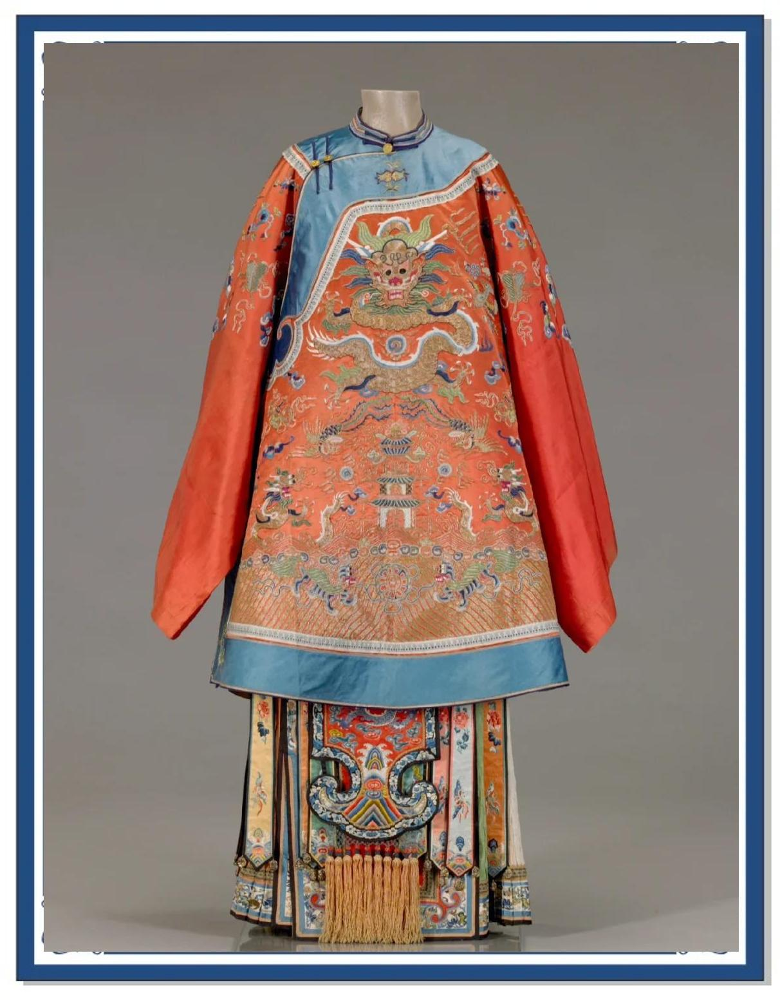
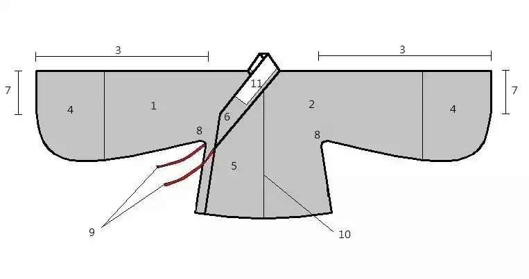
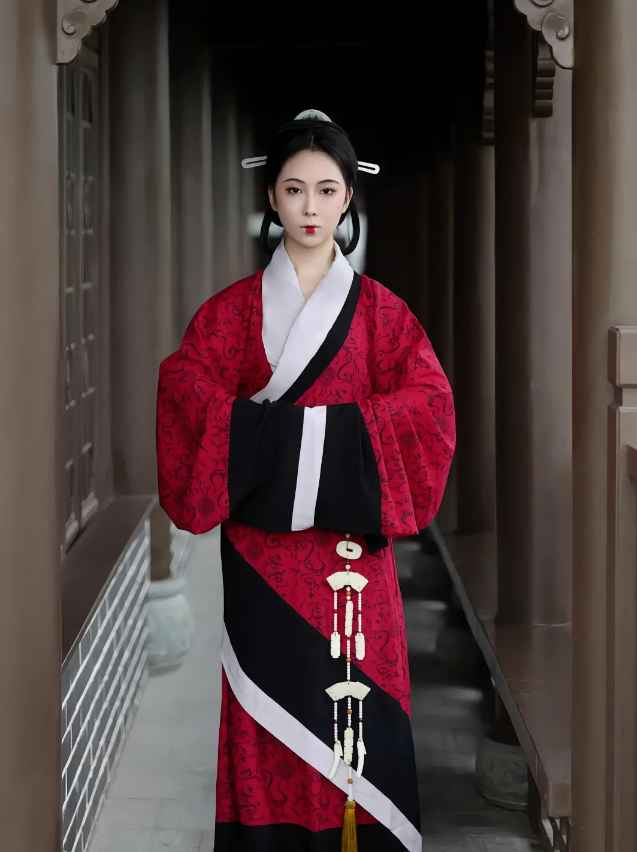
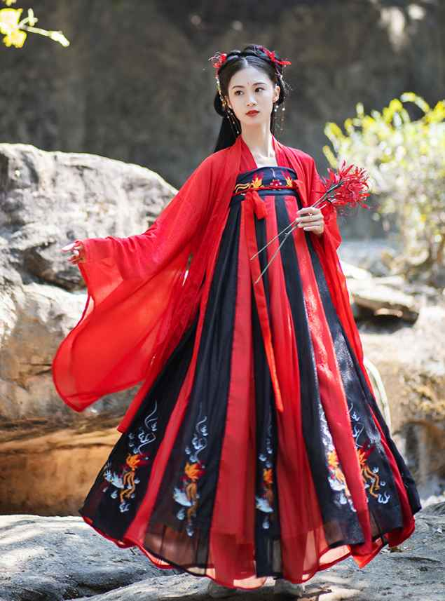
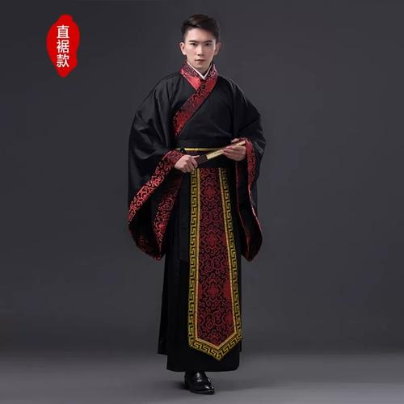
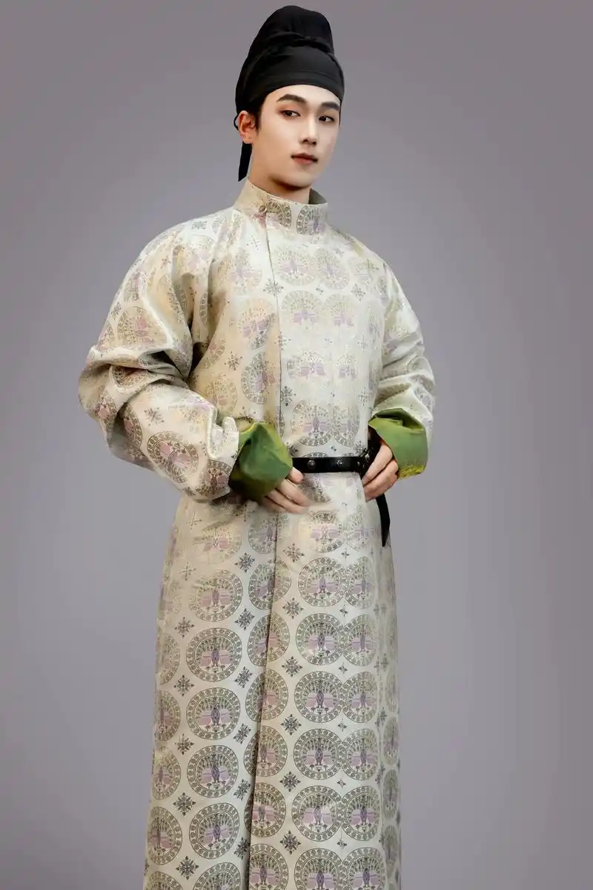
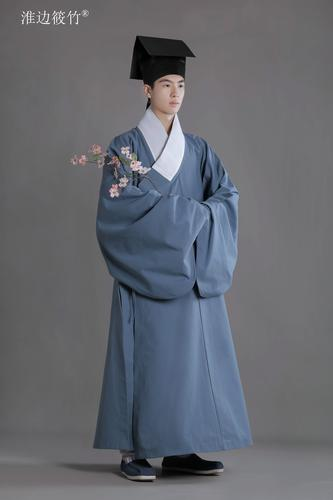
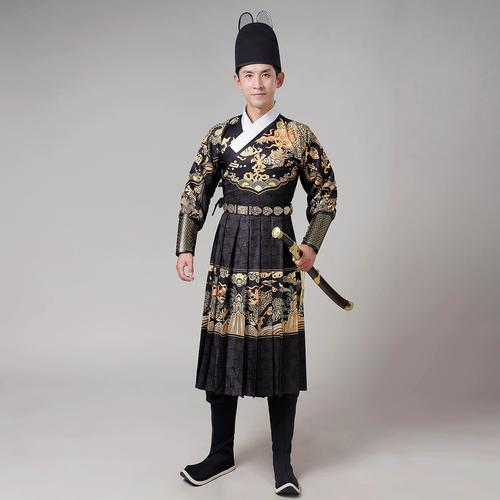

# classisland-mgmt-cfg ClassIsland集控配置

# 🌸 **汉服文化：千年风华，一衣承情** 🌸  
> [!caution]
> # **这个服饰不是汉服！！！**
> ## **这个服饰不是汉服！！！**
> ### **这个服饰不是汉服！！！**
> #### **这个服饰不是汉服！！！**
> ##### **这个服饰不是汉服！！！**
> ###### **这个服饰不是汉服！！！**     
> ###### 这个服饰不是汉服！！！
> ##### 这个服饰不是汉服！！！
> #### 这个服饰不是汉服！！！
> ### 这个服饰不是汉服！！！
> ## 这个服饰不是汉服！！！
> # 这个服饰不是汉服！！！

## 📜 **一、汉服：穿越千年的东方美学**
汉服，全称“汉民族传统服饰”，是中华文化的重要符号之一。它始于黄帝“垂衣裳而天下治”，历经秦汉的庄重、魏晋的飘逸、唐宋的华美、明清的典雅，承载着华夏文明的审美与智慧。  
**汉服之美，在于形制**：  
- **交领右衽**：象征天地交泰，体现东方哲学。  
- **宽袍大袖**：展现飘逸灵动，传递文人风骨。  
- **纹样寓意**：龙凤呈祥、梅兰竹菊，一针一线皆有故事。  

 

1. 左衣身
2. 右衣身
3. 袖：衣袖。汉服接袖处传统上是布的边界，即依布幅大小决定，与今日西式服装在肩膀处接袖不同。
4. 袂（mèi）：指袼与袪之间的部分，即接上的衣袖部分。
5. 衽（rèn）：指衣服的胸前部分。汉服的衽一般是向右掩（从正面看，右边的衣襟覆盖在左边的衣襟之上，呈小写的“y”），称为右衽。
6. 襟：指衣服的胸前部分的边缘，即交领、直领衣服的领缘。
7. 袪（qū）：指袖口。汉服有些款式袖口较衣袖窄，称为“收袪”。
8. 袼（gē）：指袖根，即与衣身相连的部分。
9. 系带：用来固定衣服
10. 裻（dú）：即中缝，由于古代布幅较窄，会在背部正中接缝，称为中缝。
11. 护领：衣领外再加一重，较衣领短，以素色布制成。  
来源：维基百科  
维基直达：[维基百科](https://zh.wikipedia.org/wiki/%E6%BC%A2%E6%9C%8D%E5%88%97%E8%A1%A8#%E6%B1%89%E6%9C%8D%E6%A7%8B%E4%BB%B6%E5%90%8D%E7%A8%B1)  
国内可用：[汉服资料馆](http://120.25.237.190/hanfu/lishi/wiki/wangye/%E6%B1%89%E6%9C%8D%E5%88%97%E8%A1%A8%20-%20%E7%BB%B4%E5%9F%BA%E7%99%BE%E7%A7%91%EF%BC%8C%E8%87%AA%E7%94%B1%E7%9A%84%E7%99%BE%E7%A7%91%E5%85%A8%E4%B9%A6%20(2023_8_20%2019_25_27).html)  

## emoji is not available! **二、汉服复兴：从历史到现代的传承**
### 🌱 **复兴背景**  
21世纪初，随着传统文化热潮兴起，汉服逐渐从古籍、影视走向大众。年轻人通过汉服表达文化认同，形成“汉服运动”，推动其从“小众爱好”发展为“文化现象”。  

### 💡 **复兴意义**  
- **文化自信**：重拾民族服饰，增强对中华文明的认同感。  
- **美学教育**：汉服的色彩、剪裁、配饰，传递东方审美哲学。  
- **社交纽带**：汉服社群、节庆活动（如花朝节、华服日）促进文化交流。  

## 👗  **三、汉服穿搭指南：入门与进阶**  
### 🎀 **基础形制选择**  

#### **👩 女装推荐**  
| 朝代 | 代表款式       | 特点                     | 适合场景         | 图示            |  
|------|----------------|--------------------------|------------------|-----------------|  
| 汉   | 曲裾深衣       | 绕襟层叠，雍容典雅       | 祭祀、典礼       |  |  
| 唐   | 齐胸襦裙       | 高腰飘逸，显身姿修长     | 赏花、雅集、摄影 |  |  
| 宋   | 褙子 + 宋裤/褶裙 | 清雅简约，轻盈便于活动   | 日常、茶会、踏青 |  |  
| 明   | [马面裙](https://gitee.com/inf2147483647/classisland-mgmt-cfg/马面裙) + 立领衫 | 端庄大气，织金刺绣精致   | 节日、婚礼、宴席 |  |  

#### **👨 男装推荐**  
| 朝代 | 代表款式       | 特点                     | 适合场景         | 图示        |  
|------|----------------|--------------------------|------------------|-------------|  
| 汉   | 直裾深衣       | 交领右衽，线条端正       | 礼仪、庆典       | |  
| 唐   | 圆领袍         | 宽摆舒朗，英气洒脱       | 出行、雅聚       |  |  
| 宋   | 直裰/道袍      | 简洁含蓄，文人风骨       | 日常、书斋、茶席 |  |  
| 明   | 道袍/曳撒      | 结构分明，稳重而有气度   | 节庆、重要场合   |  |  

### 💄 **搭配小技巧**  

#### **👩 女装搭配**  
- **发型**：唐风双环髻、宋制高髻、明制发髻，搭配发簪、步摇、珠花。  
- **配饰**：禁步、玉佩、团扇、披帛、绣花荷包，增添柔美韵味。  
- **鞋履**：弓鞋、翘头履、绣花布鞋，与衣裙色彩呼应。  

#### **👨 男装搭配**  
- **发型**：束发戴冠、巾帽（如唐幞头、明儒巾），简洁利落。  
- **配饰**：玉佩、革带、折扇、荷包，体现儒雅气质。  
- **鞋履**：布鞋、革靴、云头履，注重款式稳重与整体协调。   

## 🎉 **四、汉服活动推荐：沉浸式体验文化**
1. **中国华服日**（每年农历三月初三）  
   - 全国多地举办汉服巡游、传统礼仪展示，堪称“汉服界春晚”。  
2. **西塘汉服文化周**  
   - 江南水乡为背景，体验汉服婚礼、射礼、茶道等传统活动。  
3. **本地汉服社活动**  
   - 搜索“城市名+汉服社”，参与雅集、手工课、古风摄影。[开封汉服社](https://cn.bing.com/search?q=%E5%BC%80%E5%B0%81%E6%B1%89%E6%9C%8D%E7%A4%BE&form=QBLH&sp=-1&lq=0&pq=%E5%BC%80%E5%B0%81%E6%B1%89%E6%9C%8D%E7%A4%BE&sc=0-5&qs=n&sk=&cvid=22D8C68A091D474584C9973630B601DB)  

## 💬 **五、常见疑问解答**
**Q: 汉服是“汉朝的服饰”吗？**
A：很多人误以为汉服是 “汉朝的服饰”，实则不然。汉服全称为 “汉民族传统服饰”，是从黄帝即位至明末清初，汉族在几千年历史中形成的具有独特风貌的服饰体系，并非单一朝代的服饰。

**Q：清代服饰是汉服吗？**
A： 不是。清朝推行的“剃发易服”政策，强制汉族及其他民族改穿满族服饰（如长袍、马褂、旗装），这导致了以“交领右衽、系带隐扣、宽袍大袖”为核心特征的汉服体系在主流社会生活中传承中断。因此，清代占主导地位的袍服、马褂等属于满族服饰体系，而非汉服。

**Q：汉服是“古装”吗？**  
A：汉服是汉民族传统服饰，与“古装”（影视剧服装）不同，它有历史依据和形制规范。  

**Q：汉服只有交领右衽吗？**
A：并非如此。交领右衽是汉服最核心、最具代表性的特征之一，是汉服形制的主流规范，但并非汉服的唯一形制，汉服的领型与衣襟样式丰富多样，且不同朝代有不同的流行风格；而 “右衽” 的衣襟规范虽为汉服主流，也仅有特殊场景会出现左衽，并非汉服常规形制。汉服中日常、吉礼绝对不用左衽

**Q：穿汉服出门会奇怪吗？**  
A：如今汉服已融入日常，地铁、商场常见同袍。自信即美，文化需要被看见！  

**Q：如何挑选第一套汉服？**  
A：
- 女性新手推荐  
  建议从 明制马面裙 或 唐制襦裙 入手。马面裙修饰身形，适配现代上衣，日常混搭方便；唐制襦裙裙头高、显比例，对身材包容性强。两者形制经典，不易出错。[用买时装的方式买汉服，西洋时装突然不香了](https://mp.weixin.qq.com/s/9l0tMLiknNKRbZzyQL0gwQ?poc_token=HP28cWmjz3E-yRcf0UOErzQZCpfORQ7KtIgGma0Y)  
- 男性新手推荐  
  可优先选择 明制道袍/直身 或 宋制圆领袍。明制男装线条简洁，穿起来大气端庄；宋制圆领袍风格清爽，适配多数体型，日常穿着也较为轻便。  

## 🌟 **结语：着一袭汉服，赴一场千年之约**  
汉服不仅是衣裳，更是流动的文化、立体的历史。穿上它，你便是行走的诗篇——低头是水墨丹青，回眸是盛世风华。  

**📢 行动号召**：  
- 关注本地汉服社，参与线下活动  
- 尝试租借或购买一套基础款汉服  
- 在社交平台分享你的汉服故事

**🌿 让我们以衣为媒，共传华夏文明！**
   
  
  
  
  
# 关于“唯交领论”的严正声明  （内容来自汉服吧）

汉服科普与推广交领是主流，但不排除其他领型。自2003年汉服复兴运动之始，交领的核心地位便已确立，成为共识，不容质疑，无可撼动。汉服吧作为“汉服运动”主要发源地之一，标识即据此设计。然近期发现，怀疑有群体通过反串为极端保守汉民族主义者，散播“只认交领右衽为汉服，甚至凡交领右衽皆为汉服”的极狭隘且严重错误的主张，意在“一计害四贤”，引发矛盾让我们内部互攻消耗。汉服吧对此严正声明，必须坚决抵制，划清界限。  

以下为对“唯交领论”宣扬者的立场质疑与行为揭露：  
1. 攻打明立领。钟爱晚明汉服的人和“明粉”有不少重叠，“明粉”应是最为知道满清是如何残害汉文化的一类人之一。引导不知情观众攻打在汉文化复兴上同一阵线的深度友军。（什么群体和“明粉”对立无需多言）  
2. 通过暗示背后“有鬼”的方式，攻打“汉服运动”的专业科普博主和同袍（汉服复兴者间的互称，取自“岂曰无衣，与子同袍”），让观众对同袍们丧失信任，任其引导，阻碍“汉服运动”发展。<mark>**且尤喜加上“女博主”的“女”字，附加引起性别对立。**</mark>（谁看汉服最不顺眼？）  
3. 以其极端排外、保守、崇古的错误主张为皮，孤立圈定汉文化在极狭隘区域，将自己的东西拱手送给他人。传播国内古画等文物多被“伪造”“修改”“胡化”的谣言，鼓吹“汉唐正统在日本，宋明正统在韩国”“国内由古至今逐渐劣化胡化”的谬论，消解汉民族文化自信心，欲使我们内部崩塌。（谁想颠覆？）  
4. 通过“反串黑”的方式，宣传历史虚无主义等反动思想，损害真正的汉本位主义者声誉，意欲“借刀杀人”！  

望全体同道明辨是非，共同捍卫基于历史事实与相互尊重的讨论环境，协力推动汉服乃至汉文化复兴事业的健康发展。  

华夏复兴  衣冠先行  
# 汉服复兴的核心阻碍与深层挑战

汉服复兴虽已从小众爱好发展为具有广泛影响力的文化现象，但在**文化认知、产业规范、社会接受、内部生态、实用适配、外部环境**等多个维度仍面临显著阻碍，制约其从“圈地自萌”走向全民日常化普及。

---

### 一、文化认知与历史断层阻碍

1.  **文化失忆与认知偏差**
    - 长达数百年的“剃发易服”导致汉服文化传承断裂，<mark>公众普遍存在“汉服=古装/戏服/影楼装”的认知误区</mark>
    - 对汉服基本形制（如交领右衽、中缝、接袖等）、历史演变、文化内涵缺乏系统了解
    - 部分人将汉服与特定朝代绑定，忽视其“汉民族传统服饰体系”的本质属性

2.  **历史叙事与民族关系误读**
    - **<mark>少数极端观点将汉服复兴与“满汉对立”挂钩，制造民族矛盾，损害汉服文化形象</mark>**
    - 部分外媒刻意曲解汉服复兴为“文化霸权”，加剧国际社会误解
    - 教科书对“剃发易服”等历史事件表述模糊（没那么清晰），影响公众对汉服复兴历史背景的正确认知

---

### 二、产业发展的结构性困境

| 问题类型 | 具体表现 | 影响 |
|---------|---------|------|
| **价格结构失衡** | 高端定制万元起，低端劣质品99元泛滥（事实上更低），中间价位性价比产品稀缺，呈“哑铃型”结构 | 挤压大众消费市场，限制日常穿着普及 |
| **品质参差不齐** | 低端产品用化纤面料、机印纹样，做工粗糙，穿1-2次即报废 | 损害汉服整体口碑，降低复购率 |
| **标准缺失与混乱** | 汉服定义、核心形制、制作工艺缺乏统一行业标准，学界、商家、爱好者各执一词 | 导致市场鱼龙混杂，消费者难以辨别真伪 |
| **同质化与抄袭严重** | <mark>设计抄袭成风，原创保护不足，“侵权易、维权难、变现难”</mark> | 打击原创设计师积极性，制约产业创新 |
| **供应链不完善** | 面料、辅料、工艺人才短缺，部分地区产业基础薄弱，依赖外地进货 | 影响产品质量稳定性，增加生产成本 |

---

### 三、内部生态的争议与乱象

1.  **形制之争的极端化**
    - “考据党”与“改良派”理念对立：前者执着于历史细节还原，后者主张适配现代生活简化形制
    - 部分“考据党”对新人“穿错形制”恶语相向，形成“圈地自萌”的排外氛围
    - 网络上频繁出现“形制警察”现象，将审美问题上升为道德批判，劝退潜在爱好者

2.  **圈子文化异化**
    - 服饰偏好被贴上立场标签，出现“非黑即白”的二元对立思维
    - 部分爱好者将汉服与“高人一等”的文化优越感绑定，产生“汉服圈鄙视链”
    - 过度强调“纯粹性”，排斥与现代元素融合，阻碍汉服生活化改良

---

### 四、社会接受与日常适配障碍

1.  **社会包容度不足**
    - 穿着汉服在公共场所易遭异样眼光、围观拍照，甚至被误认为“奇装异服”
    - <mark>部分企业、学校对员工/学生穿汉服有隐性限制，缺乏文化包容氛围</mark>（没那么宽松）
    - 传统文化教育缺失，导致大众对汉服文化价值认同感低

2.  **现代生活适配性差**
    - 传统汉服宽袍大袖、层层叠穿，不便工作、运动、乘坐公共交通等现代生活场景
    - 缺乏适配日常的改良款式，如带口袋、拉链、便于活动的设计
    - 洗涤、保养成本高，部分传统面料（如真丝、棉麻）易皱、易损，不适合快节奏生活

3.  **配套设施与服务缺失**
    - 公共场所（如商场、景区）缺乏汉服更换、存放设施
    - 专业汉服妆造、发型设计、摄影服务价格偏高，限制普通消费者体验
    - 缺乏针对汉服穿着者的礼仪指导，导致部分人穿着时举止不当引发争议

---

### 五、外部环境与资源制约

1.  **经济下行压力影响**
    - 全球经济波动导致消费降级，汉服作为非必需品，市场需求收缩
    - 年轻人消费能力有限，难以承担高品质汉服的价格，转向低价劣质品或放弃购买

2.  **西方审美与消费主义冲击**
    - 现代服装体系被西方主导，大众审美受牛仔裤、T恤等西式服装长期影响
    - 快时尚品牌快速迭代，挤压传统服饰生存空间，消费者更倾向于廉价、易更换的服装

3.  **人才与教育体系短板**
    - 专业汉服设计、制作、研究人才匮乏，高校相关专业设置不足
    - 传统工艺（如织锦、刺绣、印染）传承困难，老艺人逐年减少，年轻传承人断层
    - 缺乏系统的汉服文化教育课程，公众获取权威知识渠道有限

---

### 六、标准制定与创新平衡难题

1.  **统一标准难产**
    - 汉服跨越数千年历史，形制多样，难以制定“一刀切”的统一标准
    - 学界、产业界、爱好者群体利益诉求不同，协调难度大
    - 缺乏官方权威机构主导标准制定，行业协会影响力有限

2.  **创新与传统的平衡困境**
    - 过度改良可能导致汉服“失魂”，失去文化辨识度（新中式还是新满式？）
    - 固守传统则难以适应现代生活，限制普及范围
    - 市场上“伪改良”产品泛滥，如加入大量影楼装元素却标榜“传统汉服”，混淆公众认知

---

### 总结与破局方向

汉服复兴的核心阻碍本质上是**传统与现代、文化与商业、小众与大众**之间的平衡难题。破局需要：
1.  建立权威标准体系，同时鼓励“传统基因+现代表达”的良性创新
2.  规范产业发展，加强原创保护，优化价格结构，提升产品品质
3.  <mark>弱化圈层对立，营造包容开放的文化氛围，避免极端化言论与行为</mark>
4.  推动汉服生活化改良，开发通勤款、校园款等适配现代场景的产品
5.  加强文化教育普及，通过媒体、学校、博物馆等渠道传播正确的汉服文化知识

汉服复兴不是简单的“复古”，而是传统文化在现代社会的创造性转化与创新性发展，需要全社会共同努力，才能让这一承载千年文明的服饰真正“活”在当下。  
# 中日韩三国传统服饰社会认知情况对比表
|对比维度|中国（汉服）|日本（和服/着物）|韩国（韩服/한복）|
| ---- | ---- | ---- | ---- |
|**核心服饰界定**|<mark>以汉民族历代服饰体系为核心，涵盖曲裾、襦裙、明制等形制，是多形制的服饰体系，并非单一款式</mark>|以江户时代定型的吴服为基础发展的着物体系，含振袖、留袖、浴衣等，浴衣为简易款，常被归为广义和服|以朝鲜王朝服饰为核心定型，分男款（道袍（**注意与汉服道袍不同！**）、周衣等）、女款（赤古里、契玛等），含传统款与现代改良款|
|**社会认知核心定位**|<mark>当代文化复兴载体，汉民族文化符号，认知中存在“传统服饰=旗袍/唐装”的历史误区，正逐步矫正</mark>|日本国粹级传统服饰，是日本文化的核心标识之一，与本土祭典、礼仪深度绑定，认知无断层|韩国民族文化象征，是国家文化软实力的重要代表，与民族身份绑定紧密，全民认知统一|
|**历史传承与认知断层**|<mark>因近代社会变革出现近百年传承断层，21世纪初才开启民间复兴，大众对形制、文化内涵的认知仍处于普及阶段</mark>|江户时代至今传承完整，无明显断层，从织造、裁剪到着装礼仪均有系统的技艺和文化传承体系|朝鲜王朝至今传承连续，虽经近代社会变迁，但民间与官方均未放弃传承，核心形制与文化内涵保留完整|
|**日常/公共场合接受度**|<mark>日常穿着接受度**区域差异大**，汉服圈、文旅城市（如西安、洛阳）接受度较高，普通城市日常穿着易受关注；公共场合（文旅活动、传统节日）接受度逐步提升，正式礼仪场合仍未普及</mark>|日常基本不穿，仅作为礼仪服饰使用；公共场合（成人式、祭典、婚礼、赏樱）穿着无违和感，是场景化的标配服饰，大众习以为常|日常穿着比和服稍高，中老年群体（尤其是农村）仍有部分日常穿简化款；公共场合（传统节日、韩服日、婚礼）穿着普遍，官方场所（景福宫）穿韩服可享福利，大众接受度高|
|**年轻群体态度**|<mark>年轻群体是**复兴主力**，90后、00后为核心，热衷形制考据、汉服穿搭、同好交流，部分年轻人将其作为日常穿搭选择，对改良汉服的接受度两极分化（考据派排斥，时尚派认可）</mark>|年轻群体将其视为“礼仪必备”，成人式穿振袖是主流选择，日常对和服的态度偏“敬而远之”，对浴衣接受度高（夏日祭、花火大会常用），小众群体热衷和服时尚改造|年轻群体兼具传承与创新，既重视传统韩服的礼仪使用，也热衷现代改良韩服的日常穿搭，韩服时尚化、年轻化改造成为潮流，网红、爱豆带动韩服普及|
|**官方层面举措与支持**|<mark>无全国性法定相关节日，地方文旅部门、非遗机构牵头开展汉服文化活动，部分景区推出汉服体验配套；未将汉服定为官方礼仪服，非遗层面仅对汉服织造、刺绣等技艺保护，无整体服饰体系扶持</mark>|无专门法定和服日式节日，但将和服织造、着装礼仪纳入非遗保护，地方政府（如京都）大力扶持和服产业与文化体验；成人式等礼仪场合获社会与官方双重认可，公共机构配套和服相关服务|设**全国韩服日**（10月22日），法定节假日穿韩服可免部分景区门票，官方将韩服纳入非遗保护并大力推广，总统就职、国宴等正式场合会穿韩服，政府牵头推动韩服文化国际传播|
|**商业化发展特征**|<mark>产业呈“圈层化+大众化”双轨，汉服实体店、线上店铺集中在文旅城市，形制款主打汉服圈，改良款面向大众；文旅融合带动汉服体验、旅拍成为主流，文创、配饰产业同步发展，但行业标准尚未统一</mark>|商业化高度成熟且体系化，从高端定制和服（正绢）到平价租赁、体验店覆盖全阶层，京都等城市形成和服体验产业链；浴衣成为大众消费品，与文创、美妆、餐饮深度结合，行业标准完善|商业化兼顾传统与现代，高端定制韩服主打礼仪场景，现代改良韩服（轻韩服）面向日常穿搭，线上线下渠道完善；韩剧、韩流带动韩服体验与周边产业发展，官方推动韩服品牌出海|
|**文化符号化与国际认知**|<mark>国际认知度较低，易与旗袍、唐装混淆，常被归为“中国古装”；国内正逐步成为汉民族文化符号，与端午、中秋等传统节日绑定，文旅宣传中高频使用</mark>|国际认知度极高，是日本文化的标志性符号，海外对和服、浴衣的辨识度高，和服体验成为日本旅游的核心项目之一，文化符号化程度深|国际认知度较高，依托韩剧、韩流实现全球传播，海外对韩服的辨识度仅次于和服，常与韩国传统建筑、美食共同作为韩国文化代表，文化符号化与民族身份绑定紧密|
